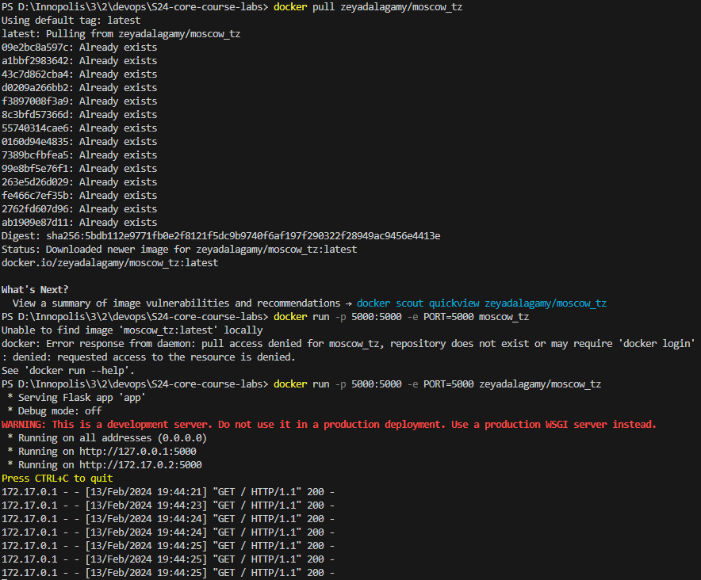

# Python Web Application Documentation

[](https://github.com/zeyadAjamy/S24-core-course-labs/actions/workflows/python-ci.yaml)

## Overview

The web application displays the current time in Moscow. It utilizes the Flask web framework to create a simple web server and the `datetime` and `pytz` modules to retrieve and format the current time.

## Code Structure

The application consists of a single Python script:

- `app.py`: This script contains the main code for the Flask web application. It imports the necessary modules, defines the Flask application instance, and sets up a route to handle requests to the root URL (`/`). When a request is received at this route, the `current_time` function is called to retrieve the current time in Moscow and return it as a response.

## Implementation Details

### Flask Application Creation

- The Flask web application is created by instantiating the `Flask` class from the `flask` module. This class represents the Flask application and provides methods for handling routes, requests, and responses.

```python
from flask import Flask

app = Flask(__name__)
```

### Define Route for Homepage

- The route `/` is defined using the `@app.route('/')` decorator. This decorator binds the URL `/` to the `current_time` function, specifying that the function should be called when a request is made to the root URL.

```python
@app.route('/')
def current_time():
    # Function implementation goes here
    pass
```

### Current Time Retrieval Function

- The `current_time` function is responsible for retrieving the current time in Moscow and formatting it as a string with the format `YYYY-MM-DD HH:MM:SS`. This function combines the usage of `datetime.now()` to get the current time and `pytz.timezone('Europe/Moscow')` to convert it to the Moscow timezone.

```python
from datetime import datetime
import pytz

def current_time():
    moscow_time = datetime.now(pytz.timezone('Europe/Moscow')).strftime('%Y-%m-%d %H:%M:%S')
    return moscow_time
```

### Running the Flask Application

- When the script is executed directly (`__name__ == '__main__'`), the Flask application is run using the `app.run()` method, which starts the development server.

```python
if __name__ == '__main__':
    app.run()
```

## How To Install and Test

To run the Flask web application, follow these steps:

1. **Create a Virtual Environment:**

   - It's recommended to use a virtual environment to isolate project dependencies. Create a new virtual environment by running:

     ```
     python -m venv venv
     ```

   - Activate the virtual environment:

     - On Windows:

       ```
       venv\Scripts\activate
       ```

     - On macOS/Linux:

       ```
       source venv/bin/activate
       ```

2. **Install Dependencies:**

   - Once the virtual environment is activated, install the required dependencies by running:
     ```
     pip install -r requirements.txt
     ```

3. **Run the Application:**

   - After installing dependencies, navigate to the directory containing the `app.py` file.
   - Run the following command to start the Flask development server:
     ```
     python app.py
     ```

4. **Test:**

   - Open a web browser and visit `http://127.0.0.1:5000/` to access the application.
   - You should see the current time in Moscow displayed on the webpage.
   - Refresh the browser tab to ensure the application continues to work as expected.

   
   

### Docker

#### Containerized Application

The application is containerized using Docker, ensuring portability and ease of deployment across different environments. Below are instructions for building, pulling, and running the Docker container.

#### How to Build

To build the Docker image locally, follow these steps:

```bash
docker build -t zeyadalagamy/moscow_tz .
```

This command builds the Docker image based on the provided Dockerfile (`Dockerfile`) in the `app_python` directory and tags it with the name `moscow_tz`.

#### How to Pull

If you prefer to pull the pre-built Docker image from a container registry instead of building it locally, you can use the following command:

```bash
docker pull zeyadalagamy/moscow_tz
```

#### How to Run

Once you have either built the Docker image locally or pulled it from a registry, you can run the container using the following command:

```bash
docker run -p 5000:5000 zeyadalagamy/moscow_tz
```



### Unit Test: Testing Current Time Format

#### Purpose:

- The `test_current_time_format` unit test ensures that the Flask application endpoint `/` returns the current time in Moscow with the expected format `YYYY-MM-DD HH:MM:SS`.

#### Fixture Setup:

- The `client` fixture is set up using `pytest.fixture`, providing a test client to interact with the Flask application.

```python
@pytest.fixture
def client():
    with app.test_client() as client:
        yield client
```

#### Test Function:

- The `test_current_time_format` function sends a GET request to the `/` endpoint and verifies that the response contains the current time in the specified format.

```python
def test_current_time_format(client):
    response = client.get("/")
    data = response.get_data(as_text=True)
    assert response.status_code == 200
    assert re.match(
        r"The current time in Moscow is: \d{4}-\d{2}-\d{2} \d{2}:\d{2}:\d{2}",
        data,
    )
```

#### Best Practices Applied:

- **Fixture Usage**: Utilizes a fixture (`client`) to set up the test client, ensuring consistency and reusability in test setup.
- **Assertion**: Asserts the expected behavior of the Flask application, validating both the HTTP status code and the format of the response data.
- **Regular Expressions**: Employs a regular expression to verify that the response contains the current time in the expected format, enabling precise validation.
- **Modularity**: Separates fixture setup and test function, promoting clarity and maintainability of the test code.
