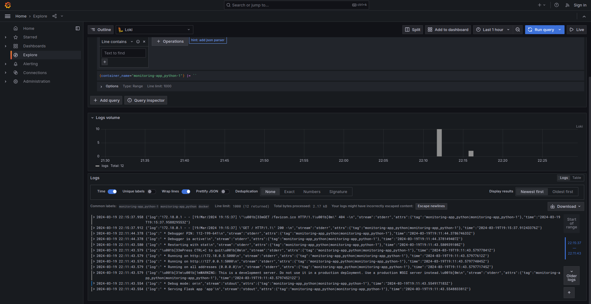
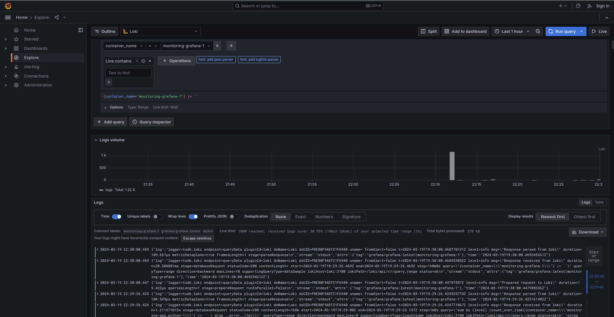

# Logging Stack Setup Documentation

## Overview
This document provides an overview of the logging stack setup consisting of Promtail, Grafana, and Loki for the web server.

## Components
### 1. Promtail
- Role: Promtail is a log shipper that collects logs from various sources on the web server and sends them to Loki for storage and analysis.
- Functionality:
  - Reads log files and streams from local files or systemd journal.
  - Labels log entries with metadata such as job, host, and application.
  - Sends log data to Loki for storage and querying.

### 2. Grafana
- Role: Grafana is a visualization tool that provides a user-friendly interface for querying and visualizing log data stored in Loki.
- Functionality:
  - Allows users to create dashboards and panels to visualize log data.
  - Supports querying log data using PromQL language.
  - Provides alerts and notifications based on log data queries.

### 3. Loki
- Role: Loki is a horizontally-scalable log aggregation system that stores log data collected by Promtail and enables efficient querying and analysis of logs.
- Functionality:
  - Stores log data in a highly efficient manner using labels and indexing.
  - Supports querying log data using LogQL language.
  - Enables users to search, filter, and aggregate log data efficiently.

## Logging Flow
1. Promtail Configuration:
   - Promtail is configured to scrape log files or streams from the web server.
   - Metadata labels are added to log entries to provide context (e.g., job, host).
   - Log data is sent to Loki for storage.

2. Loki Storage:
   - Loki stores the log data in a distributed, horizontally-scalable manner.
   - Logs are indexed and labeled for efficient querying.
   - Loki provides APIs for querying log data using LogQL language.

3. Grafana Visualization:
   - Grafana connects to Loki as a data source.
   - Users can create dashboards and panels to visualize log data.
   - Queries can be written in PromQL language to retrieve log data.

## Benefits
- Centralized Logging: All logs from the web server are collected and stored in a centralized location (Loki).
- Efficient Querying: Loki's indexing and labeling system enable fast and efficient querying of log data.
- Visualization: Grafana provides a user-friendly interface for visualizing log data through dashboards and panels.
- Scalability: The logging stack can scale horizontally to handle increasing log volumes.

## Screenshots

## Conclusion
The logging stack comprising Promtail, Grafana, and Loki provides a comprehensive solution for collecting, storing, querying, and visualizing log data from the web server.
