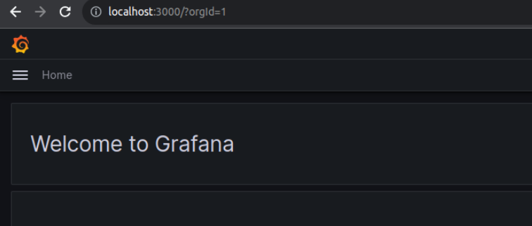
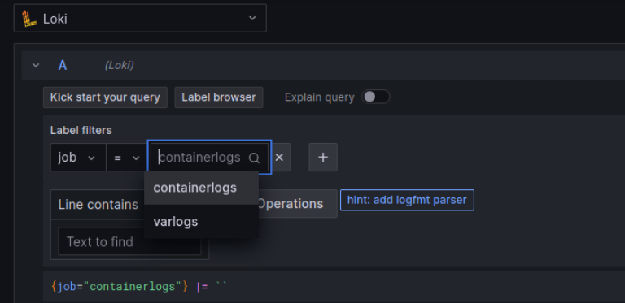
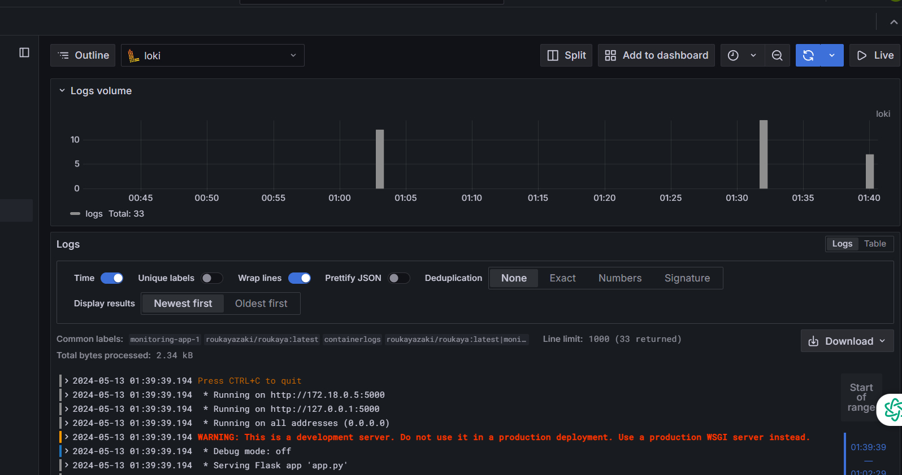
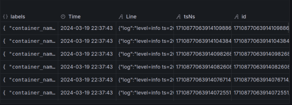

# Logging, Monitoring, and Visualization

## Steps

### Logging

- Make sure the application generates logs that can be accessed when running the container.
- (Optional) write code to generate application-specific logs:
  - **Python App:** Flask provides `Flask.Logger` which is a standard [`logging`.Logger](https://docs.python.org/3/library/logging.html#logging.Logger)

### Exporting logs

- An HTTP endpoint for application logs by Loki

### Preparing Environment

- Write a docker-compose.yaml for deploying the application with the logging and monitoring stack in a single network [[ref.](https://github.com/grafana/loki/blob/main/production/docker-compose.yaml)].
- Write configuration files for Loki [[ref.](https://grafana.com/docs/loki/latest/configuration/examples/)], Promtail [[ref.](https://grafana.com/docs/loki/latest/clients/promtail/configuration/)].
  - **Loki configuration** specifies internal settings for Loki server and where to store logs (locally or remotely).
  - **Promtail configuration** contains information on the Promtail server, where positions are stored, and how to scrape logs from files.
- Run the 2 containers with a `command` that specifies config file location.

### Demo

- Run `docker-compose up` and verify that all containers are running.

- Verify the application is running at <http://localhost:5000>

  

- Verify Grafana UI is accessible at <http://localhost:3000>

  - Default credentials: `admin:admin`

    

- Configuration &rarr; Data source &rarr; Add data source

  - &rarr; Loki &rarr; URL = `http://loki:3100` &rarr; Save and test.

- Explore &rarr; Loki &rarr; Add query &rarr; Write PromQL query or use UI builder.

  - We can see that container logs were scraped successfully.

    

- Verify Prometheus UI is accessible at http://localhost:9090/targets and all targets are up in status tab, you can also run queries with autocompletion.
    
    
    
    

### Dashboards

- Now we can create interesting dashboards from data collected by Loki and export them as reusable JSON.

  

  

## Best Practices

- Official guides: [Grafana](https://grafana.com/docs/grafana/latest/best-practices/), [Loki](https://grafana.com/docs/loki/latest/best-practices/)
- Create descriptive logs that follow a common format.
- Implement log rotation to save memory and disk space.
- Create simple, easy to interpret dashboards with meaningful names.
- When configuring alerts, try to have them triggered only when attention is needed.
- Avoid unnecessary dashboard reloading to reduce network load.
